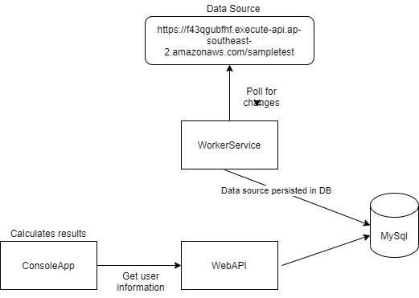

# Seven West Media Tech Test

## Solution Design

## Configuration instructions
1. Run SWMTechTest.Common\Sql\Create.sql to create the required MySQL DB tables
2. Add connection strings to SWMTechTest.WebApi\appsettings.json and SWMTechTest.WorkerService\appsettings.json
3. Configure the endpoing for SWMTechTest.WebApi in SWMTechTest.ConsoleApp\appsettings.json

## Running the app
1. Run SWMTechTest.WorkerService to populate the database, this service will poll the datasource every 60 seconds for changes (configurable)
2. Launch SWMTechTest.WebApi
3. Launch SWMTechTest.ConsoleApp to view the answers to the problems posed in the question
